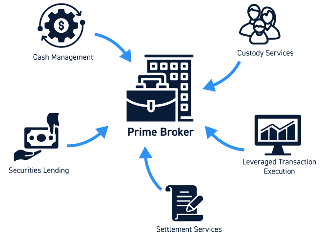

## Introduction / 简介

**Equities Prime Brokerage (PB)** acts as a one-stop "super butler" and "arsenal" for hedge funds and large institutional investors. While the fund's core competency is its **trading strategy**, the PB's core competency is solving all **logistical** and **funding** problems outside of that strategy.

**股票主经纪商业务 (Prime Brokerage)** 是为对冲基金和大型机构投资者提供的一站式“超级管家”和“军火库”。如果说基金的核心能力是**交易策略**，那么 PB 的核心能力就是解决除策略以外的所有**后勤**和**资金**问题。

## Core Business Model Summary / 核心业务模式汇总

The following table breaks down the Prime Brokerage business by its operational pillars, core products, the specific problems they solve for clients, and their key advantages.

下表按业务支柱、核心产品、解决的具体痛点以及主要优势，对主经纪商业务进行了详细拆解。

| Business Area   业务领域 | Core Product & Key Mechanics   核心产品与核心机制 | Problem Solved   解决的痛点 | Advantages   优势 |
| :--- | :--- | :--- | :--- |
| **Physical Prime (Financing)**   实物主经纪商 (融资) | **Cash Margin Financing**   现金保证金融资    **Key Mechanics (核心机制):**   Clients pay **Margin Interest** (e.g., SOFR + Spread). The bank manages risk by setting **Margin Requirements**.   客户支付**融资利息**（如 SOFR + 利差）。银行通过设定**维持保证金**比例来管理风险。 | **Capital Constraint:**   Clients want to amplify returns (leverage) but are limited by their own capital base.    **资金痛点：**   客户希望放大收益（上杠杆），但受限于自有资金规模。 | • **Maximize Efficiency:** Maximizes capital efficiency via leverage.   • **Larger Exposure:** Allows clients to hold larger long positions than cash would permit.    • **效率最大化：** 通过杠杆最大化资金使用效率。  • **扩大敞口：** 允许客户持有比现金所能支持的更大的头寸。 |
| **Physical Prime (Securities Lending)**   实物主经纪商 (证券借贷) | **SBL & Repo**   (Securities Borrowing & Lending)   证券借贷与回购协议    **Key Mechanics (核心机制):**   Clients pay a **Borrow Fee**. For "Hard-to-Borrow" stocks, this fee can be very high. Often structured as a **Reverse Repo**.   客户支付**借券费**。对于“难借”的股票，费用极高。通常通过**逆回购 (Reverse Repo)** 的形式构建。 | **Short Selling Restriction:**   Clients want to short a stock (bet on price drop) but cannot sell what they do not own.    **做空痛点：**   客户看跌某股票想做空，但不能卖出自己手里没有的东西。 | • **Enable Shorting:** Enables Long/Short strategies.   • **Liquidity:** Provides liquidity for "hard-to-borrow" assets.   • **Yield:** Generates extra yield for asset lenders.    • **实现做空：** 支持多空策略的执行。  • **提供流动性：** 为“难借”资产提供流动性。  • **产生收益：** 为借出资产的一方创造额外收益。 |
| **Physical Prime (Operations)**   实物主经纪商 (运营) | **Clearing, Settlement & Custody**   清算、结算与托管    **Key Mechanics (核心机制):**   **Centralized Clearing.** The PB consolidates trades from various executing brokers into one account.   **集中清算。** 主经纪商将来自不同执行券商的所有交易汇总到一个账户中。 | **Operational Complexity:**   Managing thousands of trades across multiple exchanges is costly and prone to settlement errors.    **运营痛点：**   管理跨多个交易所的数千笔交易成本极高，且容易出现结算错误。 | • **Centralization:** Centralizes asset safekeeping.   • **Efficiency:** Reduces back-office administrative burden.   • **Risk Mitigation:** Mitigates counterparty and settlement risks.    • **集中管理：** 集中保管资产，确保安全。  • **提升效率：** 减轻后台行政负担。  • **降低风险：** 缓解对手方风险和结算风险。 |
| **Synthetic Prime (Delta One)**   合成主经纪商 (Delta One) | **Equity Swaps / Total Return Swaps (TRS)**   股票互换 / 总回报互换    **Key Mechanics (核心机制):**   The client receives the **"Total Return"** (Capital Gains + Dividends) and pays a **"Financing Rate"** to the bank.   客户收取**“总回报”**（资本增值+股息），并向银行支付**“融资利率”**。 | **Market Access & Efficiency:**   Direct ownership is difficult (e.g., restricted markets), tax-inefficient, or capital-intensive.    **准入与效率痛点：**   直接持有实物股票可能面临市场准入限制、税务低效或资金占用过高的问题。 | • **Market Access:** Access restricted markets (e.g., China A-shares, emerging markets).   • **High Leverage:** Often requires lower margin than physical financing.   • **Operational Ease:** Avoids stamp duties and custody complexities.    • **市场准入：** 轻松进入受限市场（如中国A股、新兴市场）。  • **高杠杆：** 通常比实物融资这就需要更低的保证金。  • **运营便捷：** 规避印花税和复杂的托管流程。 |

## Key Roles & Skills in Prime Brokerage / 核心岗位与技能

The Prime Brokerage ecosystem relies on a diverse set of professionals, from client-facing sales to technical builders. Below are the key roles and the critical skills required to succeed in each.

主经纪商业务生态依赖于多种专业人才的协同工作，从面向客户的销售到技术构建者。以下是核心岗位及其所需的关键技能。

#### 1. Front Office Roles (前台岗位)

* **Prime Brokerage Sales / Relationship Management (RM)**
    * **Focus:** Client acquisition, negotiation, and concierge service.
    * **Skills:** Negotiation, deep understanding of the hedge fund landscape, cross-selling capabilities (IPOs, Research).
    * **销售/客户关系管理:** 专注于客户获取、谈判及“管家式”服务。所需技能包括谈判能力、对对冲基金行业的深刻理解及交叉销售能力。

* **Securities Lending Trader (Stock Loan)**
    * **Focus:** Sourcing liquidity for hard-to-borrow stocks and managing inventory.
    * **Skills:** Repo/SBL market mechanics, understanding borrow costs/rates, inventory management.
    * **证券借贷交易员:** 专注于为“难借”股票寻找流动性并管理库存。所需技能包括理解回购/借贷市场机制、借贷成本及库存管理。

* **Delta One / Synthetic Trader**
    * **Focus:** Managing the risk of the Equity Swaps book (hedging Delta/Gamma).
    * **Skills:** Equity Swaps pricing, hedging strategies, understanding funding spreads (SOFR/Libor), and market microstructure.
    * **Delta One / 合成交易员:** 专注于管理股票互换账簿的风险。所需技能包括互换定价、对冲策略及对资金利差和市场微观结构的理解。

* **Structuring / Strategist :**
    * **Focus:** Designing financing solutions and building automated pricing/risk infrastructure.
    * **Skills:** **Python/SQL/KDB+** (automation), Financial Engineering (Greeks, RWA optimization), and translating client needs into technical solutions.
    * **结构化 / 策略师 :** 专注于设计融资方案及搭建自动定价/风控基础设施。所需技能包括 Python/SQL/KDB+（自动化）、金融工程（Greeks, RWA优化）及将客户需求转化为技术方案的能力。

#### 2. Control & Support Roles (控制与支持岗位)

* **Prime Risk Management**
    * **Focus:** Monitoring leverage and portfolio concentration to prevent client defaults.
    * **Skills:** Quantitative risk modeling (VaR, Stress Testing), credit risk assessment.
    * **主经纪商风控:** 监控杠杆和持仓集中度以防止违约。需要量化风险建模（VaR, 压力测试）及信用风险评估技能。

* **Operations / Client Service**
    * **Focus:** Trade settlement, asset custody, and corporate actions processing.
    * **Skills:** Trade lifecycle management (DTCC/Euroclear), operational process optimization.
    * **运营 / 客服:** 专注于交易结算、资产托管及公司行动处理。需要熟悉交易生命周期管理及流程优化。

* **Technology / Data Engineering**
    * **Focus:** Building low-latency trading platforms and data lakes.
    * **Skills:** Software engineering (C++, Java), Cloud infrastructure (AWS), large-scale database management.
    * **技术 / 数据工程:** 专注于构建低延迟交易平台及数据湖。需要软件工程及云基础设施技能。

## Conclusion / 总结

Prime Brokerage is the infrastructure that powers the hedge fund industry.

* **Physical Prime** solves the fundamental needs of borrowing money (**Margin**) and borrowing shares (**Stock Loan**).
* **Synthetic Prime** solves the advanced needs of **capital efficiency** and **global access** through derivatives.

For a Structuring Analyst, the opportunity lies in **automating** these high-volume workflows (e.g., automated swap pricing, real-time risk monitoring) to improve the desk's scalability and response time.

主经纪商业务是驱动对冲基金行业的“基础设施”。

* **实物业务 (Physical)** 解决了“借钱” (**融资**) 和“借票” (**借券**) 的基本需求。
* **合成业务 (Synthetic)** 通过衍生品解决了**资金效率**和**全球市场准入**的高级需求。

