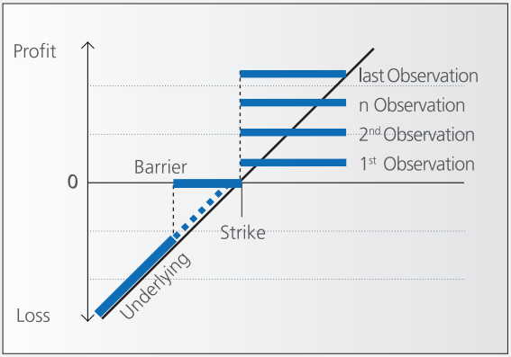

```{python}
#| include: false
# 全局初始化代码（不显示在文章中）
import numpy as np
import matplotlib.pyplot as plt
import matplotlib as mpl

# 设置全局样式
mpl.rcParams['figure.figsize'] = [10, 6]
mpl.rcParams['figure.dpi'] = 100
mpl.rcParams['font.size'] = 11
mpl.rcParams['axes.grid'] = True
mpl.rcParams['grid.alpha'] = 0.3
mpl.rcParams['lines.linewidth'] = 2.5
plt.style.use('seaborn-v0_8-darkgrid')

# 定义颜色方案
C_PAYOFF = '#1f77b4'      # 到期收益 - 蓝色
C_PRICE = '#ff7f0e'       # 今日价格 - 橙色
C_BARRIER = '#d62728'     # 障碍线 - 红色
C_STRIKE = '#2ca02c'      # 行权价 - 绿色
C_ZONE = '#9467bd'        # 特殊区域 - 紫色
C_NEUTRAL = '#7f7f7f'     # 中性线 - 灰色

def add_barrier(ax, barrier_level, label, color=C_BARRIER, linestyle='--'):
    """添加障碍线"""
    ax.axvline(x=barrier_level, color=color, linewidth=1.5, alpha=0.8, 
               linestyle=linestyle, label=label)

def add_strike(ax, strike_level, label, color=C_STRIKE, linestyle=':'):
    """添加行权线"""
    ax.axvline(x=strike_level, color=color, linewidth=1.5, alpha=0.8, 
               linestyle=linestyle, label=label)

def add_shaded_zone(ax, x_range, color, alpha=0.15, label=None):
    """添加阴影区域"""
    ax.axvspan(x_range[0], x_range[1], color=color, alpha=alpha, label=label)
```

## Executive Summary / 核心摘要

This guide deconstructs the key equity derivatives found in the Asian and global markets, ordered from foundational building blocks to complex structured products.

We focus on the commercial logic: **Market View**, **Payoff Mechanics**, and **Pricing Drivers**.

本文解构了亚洲及全球市场中的核心股票衍生品，按从基础积木到复杂结构化产品的逻辑排序。我们将重点剖析其商业逻辑：**市场观点**、**支付机制**以及**定价驱动因素**。

---

## 1. Equity Swaps (Delta One) / 股票互换

**The "Synthetic Access" Tool.** The foundation of Prime Brokerage.
**"合成准入"工具。** 主经纪商业务的基石。

* **What is it (是什么):**
    * A contract to exchange the **Total Return** of a stock (Dividends + Capital Gains) for a **Financing Rate** (e.g., SOFR + Spread).
    * 一种交换股票**总回报**（股息+资本增值）与**融资利率**（如 SOFR + 利差）的合约。
* **Market View (市场观点):**
    * **Directional (Long/Short).** You want exposure to a stock without owning it (e.g., to access restricted markets like China A-shares or avoid stamp duty).
    * **方向性交易（做多/做空）。** 希望在不持有实物股票的情况下获得敞口（例如进入中国A股等受限市场或规避印花税）。
* **Pricing Formula (定价公式):**
    * The value of an Equity Swap to the payer of the equity return is:
    * $$V_{swap} = N \times (S_t - S_0) - N \times \sum_{i=1}^{n} (r_i + s) \times \Delta t_i$$
    * Where $S_t$ is current price, $S_0$ is initial price, $r$ is the benchmark rate (e.g. SOFR), and $s$ is the spread.
* **Pricing Driver (定价因子):**
    * **Financing Spread & Borrow Cost.** The price is essentially the cost of funding.
    * **融资利差与借券成本。** 价格本质上是资金成本。

```{python}
#| label: fig-swap
#| fig-cap: "Equity Swap (Delta One) - Linear Payoff"
#| column: page
#| code-fold: true

# 生成数据
s = np.linspace(80, 120, 200)
s0 = 100 
payoff = s - s0
financing_cost = 0.02 * (s - s0)  # 假设2%的融资成本
price_today = payoff - financing_cost

# 创建图表
fig, ax = plt.subplots()
ax.plot(s, payoff, label='Payoff at Maturity', color=C_PAYOFF, linestyle='-')
ax.plot(s, price_today, label='Price Today (Financing Cost Included)', 
         color=C_PRICE, linestyle='--')
ax.axhline(y=0, color='black', linewidth=0.8, alpha=0.7)
ax.axvline(x=s0, color='black', linewidth=0.8, alpha=0.3, linestyle='--', 
           label=f'Initial Price = {s0}')
ax.set_title('1. Equity Swap (Delta One)', fontsize=14, fontweight='bold')
ax.set_xlabel('Stock Price at Maturity', fontsize=12)
ax.set_ylabel('Payoff', fontsize=12)
ax.legend(loc='best', fontsize=10)
ax.grid(True, alpha=0.3)
ax.set_xlim(80, 120)
plt.tight_layout()
plt.show()
```

如 @fig-swap 所示，股票互换的收益是线性的，反映了标的资产价格的直接敞口。融资成本的存在使今日价格曲线略低于到期收益曲线。<br>
As shown in @fig-swap, equity swaps provide linear payoff, reflecting direct exposure to the underlying asset price. The financing cost causes the price today curve to be slightly lower than the payoff at maturity curve.

---

## 2. Asian Options / 亚式期权

**The "Cheaper" Option.** Popular for hedging corporate expenses or reducing volatility.
**"更便宜"的期权。** 常用于企业对冲或降低波动率风险。

* **What is it (是什么):**
    * An option where the payoff depends on the **Average Price** of the underlying over time, rather than the final price.
    * 支付取决于标的资产在一段时间内的**平均价格**，而非最终价格。
* **Market View (市场观点):**
    * **Bullish/Bearish but Cost-Sensitive.** You want protection or upside but want to pay less premium than a standard Vanilla option.
    * **看涨/看跌但对成本敏感。** 希望获得保护或收益，但希望支付比普通香草期权更低的权利金。
* **Pricing Formula (定价公式 - Geometric Average Call):**
    * $$Payoff = \max(0, A_T - K)$$
    * Where $A_T$ is the average price: $A_T = \frac{1}{n} \sum_{i=1}^{n} S_{t_i}$
* **Pricing Driver (定价因子):**
    * **Volatility.** Averaging reduces volatility, making Asian options **cheaper** than standard European options.
    * **波动率。** 平均化处理降低了波动率，因此亚式期权比标准欧式期权更便宜。

```{python}
#| label: fig-asian
#| fig-cap: "Asian Option vs Vanilla Call"
#| column: page
#| code-fold: true

# 生成数据
s = np.linspace(70, 130, 200)
K = 100

# 模拟价格路径
vanilla_call = np.maximum(s - K, 0)

# 模拟亚式期权（平均价格降低了波动性）
asian_call = np.zeros_like(s)
for i in range(len(s)):
    if s[i] <= K:
        asian_call[i] = 0
    else:
        # 假设平均价格比最终价格低5%，代表波动性降低
        avg_price = 0.95 * s[i] if s[i] > K else s[i]
        asian_call[i] = np.maximum(avg_price - K, 0)

# 创建图表
fig, ax = plt.subplots()
ax.plot(s, vanilla_call, label='Vanilla Call Option', color=C_PAYOFF, linestyle='-', linewidth=2.5)
ax.plot(s, asian_call, label='Asian Call Option (Averaged)', color=C_PRICE, linestyle='--', linewidth=2.5)

add_strike(ax, K, f'Strike K = {K}')
add_shaded_zone(ax, [K, 130], C_PAYOFF, 0.1, 'Vanilla ITM Zone')

ax.set_title('2. Asian Option vs Vanilla Call', fontsize=14, fontweight='bold')
ax.set_xlabel('Stock Price at Maturity', fontsize=12)
ax.set_ylabel('Option Value', fontsize=12)
ax.legend(loc='best', fontsize=10)
ax.grid(True, alpha=0.3)
ax.set_xlim(70, 130)
ax.set_ylim(0, 35)
plt.tight_layout()
plt.show()
```

如 @fig-asian 可以看出，亚式期权的价值曲线更平缓，价格更低。这是因为平均化过程降低了波动率风险。<br>
As illustrated in @fig-asian, the Asian option value curve is flatter and lower priced due to the averaging process reducing volatility risk.

---

## 3. Barrier Options / 障碍期权

**The "Conditional" Option.** The key building block for Autocalls.
**"有条件"的期权。** 构建 Autocall 产品的核心积木。

* **What is it (是什么):**
    * Options that get **activated (Knock-in)** or **extinguished (Knock-out)** if the price hits a certain barrier level.
    * 当价格触及特定障碍水平时，会被**激活（敲入）**或**失效（敲出）**的期权。
* **Types (类型):**
    * **Down-and-In Put (DIP):** The "danger" component in structured notes. Active only if the market crashes.
    * **Up-and-Out Call:** A cheaper call option that disappears if the market rallies too much.
* **Pricing Formula (Down-and-In Put Payoff):**
    * $$Payoff = \max(0, K - S_T) \times \mathbb{1}_{\{\min(S_t) < B\}}$$
    * Only pays if the minimum price path $\min(S_t)$ touched the Barrier $B$.
* **Pricing Driver (定价因子):**
    * **Skew (偏斜).** The probability of hitting a barrier is highly sensitive to the volatility skew (e.g., OTM puts are expensive).
    * **偏斜。** 触及障碍的概率对波动率偏斜高度敏感（例如价外看跌期权通常很贵）。

```{python}
#| label: fig-barrier
#| fig-cap: "Barrier Options - Conditional Payoffs"
#| column: page
#| code-fold: true

# 生成数据
s = np.linspace(60, 140, 300)
K = 100
B_knockin = 85  # 敲入障碍
B_knockout = 115  # 敲出障碍

# Down-and-In Put
dip_payoff = np.zeros_like(s)
dip_payoff[s < B_knockin] = np.maximum(K - s[s < B_knockin], 0)

# Up-and-Out Call
uoc_payoff = np.maximum(s - K, 0)
uoc_payoff[s > B_knockout] = 0

# 创建子图
fig, (ax3a, ax3b) = plt.subplots(1, 2, figsize=(14, 6))

# 左图：Down-and-In Put
ax3a.plot(s, dip_payoff, label='DIP Payoff', color=C_PAYOFF, linewidth=2.5)
add_barrier(ax3a, B_knockin, f'Knock-In Barrier = {B_knockin}', C_BARRIER, '--')
add_strike(ax3a, K, f'Strike K = {K}')
ax3a.fill_between(s[s <= K], 0, dip_payoff[s <= K], color=C_PAYOFF, alpha=0.3, label='Active Zone')
ax3a.set_title('Down-and-In Put (DIP)', fontsize=12, fontweight='bold')
ax3a.set_xlabel('Stock Price at Maturity', fontsize=11)
ax3a.set_ylabel('Payoff', fontsize=11)
ax3a.grid(True, alpha=0.3)
ax3a.legend(loc='upper right', fontsize=9)
ax3a.set_xlim(60, 140)
ax3a.set_ylim(0, 45)

# 右图：Up-and-Out Call
ax3b.plot(s, uoc_payoff, label='UOC Payoff', color=C_PRICE, linewidth=2.5)
add_barrier(ax3b, B_knockout, f'Knock-Out Barrier = {B_knockout}', C_BARRIER, '--')
add_strike(ax3b, K, f'Strike K = {K}')
ax3b.fill_between(s[(s >= K) & (s <= B_knockout)], 0, 
                  uoc_payoff[(s >= K) & (s <= B_knockout)], 
                  color=C_PRICE, alpha=0.3, label='Active Zone')
ax3b.set_title('Up-and-Out Call (UOC)', fontsize=12, fontweight='bold')
ax3b.set_xlabel('Stock Price at Maturity', fontsize=11)
ax3b.set_ylabel('Payoff', fontsize=11)
ax3b.grid(True, alpha=0.3)
ax3b.legend(loc='upper left', fontsize=9)
ax3b.set_xlim(60, 140)
ax3b.set_ylim(0, 25)

plt.suptitle('3. Barrier Options: Conditional Payoffs', fontsize=14, fontweight='bold', y=1.02)
plt.tight_layout()
plt.show()
```

@fig-barrier 展示了两种常见的障碍期权。**Down-and-In Put** 只在股价跌破障碍价后才被激活，而 **Up-and-Out Call** 则在股价涨破障碍价后失效。<br>
As shown in @fig-barrier, the Down-and-In Put is activated only if the stock price falls below the barrier, while the Up-and-Out Call becomes worthless if the stock price rises above its barrier.

---

## 4. Reverse Convertibles / 反向可转换票据

**The "High Yield" Note.** Selling insurance to earn income.
**"高收益"票据。** 通过卖出保险来赚取收益。

* **What is it (是什么):**
    * A short-term note that pays a **high coupon**. In exchange, the investor **sells a Put option** (usually a DIP).
    * 一种支付**高票息**的短期票据。作为交换，投资者**卖出一个看跌期权**（通常是下行敲入看跌期权）。
* **Market View (市场观点):**
    * **Neutral to Bullish.** You want high income and don't think the market will crash.
    * **中性偏多。** 追求高收益，且认为市场不会崩盘。
* **Pricing Formula (Note Value):**
    * $$V_{note} = V_{bond} - V_{put} + Coupon$$
    * The investor is **Short Put**, so the value of the Put reduces the note's upfront cost, funding the high coupon.
* **Risk (风险):**
    * If the stock crashes below the barrier, you receive the **physical stock** (which has lost value) instead of your principal. "Converted" from cash to stock.
    * 如果股价跌破障碍，你将收到**实物股票**（已贬值）而非本金。本金从现金"转换"为了股票。

```{python}
#| label: fig-reverse
#| fig-cap: "Reverse Convertible Note Payoff"
#| column: page
#| code-fold: true

# 生成数据
s = np.linspace(50, 150, 300)
K = 100
B = 80  # 敲入障碍
coupon = 8  # 高票息

# 票据价值 = 债券价值 + 票息 - 看跌期权价值
bond_value = 100  # 本金
short_put = -np.maximum(K - s, 0)  # 卖出看跌期权
short_dip = -np.maximum(K - s, 0) * (s < B)  # 卖出DIP
note_value = bond_value + coupon + short_dip  # 使用DIP作为更现实的假设

# 创建图表
fig, ax = plt.subplots()
ax.plot(s, note_value, label='Reverse Convertible Note Value', 
         color=C_PAYOFF, linewidth=2.5)
ax.plot(s, bond_value + coupon * np.ones_like(s), 
         label='Bond + Coupon Value', color=C_STRIKE, linestyle=':', linewidth=2)
ax.plot(s, bond_value + short_dip, 
         label='Short DIP Impact', color=C_BARRIER, linestyle='--', alpha=0.7)

add_barrier(ax, B, f'Knock-In Barrier = {B}')
add_strike(ax, K, f'Strike/Principal = {K}')

# 标记关键区域
ax.fill_between(s[s < B], note_value[s < B], bond_value + coupon, 
                 color=C_BARRIER, alpha=0.2, label='Conversion Risk Zone')
ax.axhline(y=bond_value, color=C_NEUTRAL, linestyle='--', alpha=0.5, 
           label='Principal Amount')

ax.set_title('4. Reverse Convertible Note', fontsize=14, fontweight='bold')
ax.set_xlabel('Stock Price at Maturity', fontsize=12)
ax.set_ylabel('Total Value', fontsize=12)
ax.legend(loc='upper left', fontsize=9, ncol=2)
ax.grid(True, alpha=0.3)
ax.set_xlim(50, 150)
ax.set_ylim(70, 120)
plt.tight_layout()
plt.show()
```

如 @fig-reverse 所示，反向可转换票据在正常市况下提供高票息，但在股价跌破障碍价时面临本金转换风险。投资者实质上是卖出保险（看跌期权）来获取额外收益。<br>
As illustrated in @fig-reverse, the Reverse Convertible Note offers high coupon payments under normal market conditions but faces conversion risk if the stock price falls below the barrier. Investors are effectively selling insurance (put option) to earn extra income.

---

## 5. Twin-Wins / 双赢结构

**The "Volatility" Play.** Betting on a big move in *either* direction.
**"波动率"玩法。** 押注市场向*任一*方向大幅波动。

* **What is it (是什么):**
    * A product that generates positive returns if the market goes **UP** (above a strike) OR **DOWN** (below a barrier).
    * 无论市场**大涨**（超过行权价）还是**大跌**（跌破障碍价），都能产生正收益的产品。
* **Market View (市场观点):**
    * **Long Volatility / Breakout.** You expect a big move but don't know the direction.
    * **做多波动率/突破。** 预期会有大行情，但不确定方向。
* **Pricing Formula (Payoff Structure):**
    * $$Payoff = \max(0, S_T - K_{up}) + \max(0, K_{down} - S_T)$$
    * Essentially a **Strangle** strategy.
* **The "Death Zone" (死亡区间):**
    * If the market stays flat (between the barriers), you earn nothing (or lose principal).
    * 如果市场横盘（处于两个障碍之间），则无收益（或损失本金）。

```{python}
#| label: fig-twinwin
#| fig-cap: "Twin-Wins Structure (Long Strangle)"
#| column: page
#| code-fold: true

# 生成数据
s = np.linspace(60, 140, 300)
K_up = 115  # 上行行权价
K_down = 85  # 下行障碍价

# Strangle策略：买入看涨 + 买入看跌
call_payoff = np.maximum(s - K_up, 0)
put_payoff = np.maximum(K_down - s, 0)
twin_win = call_payoff + put_payoff

# 创建图表
fig, ax = plt.subplots()
ax.plot(s, twin_win, label='Twin-Win Payoff', color=C_PAYOFF, linewidth=2.5)
ax.plot(s, call_payoff, label='Call Component (K=$115$)', color=C_STRIKE, linestyle='--', alpha=0.7)
ax.plot(s, put_payoff, label='Put Component (K=$85$)', color=C_BARRIER, linestyle='--', alpha=0.7)

add_barrier(ax, K_up, f'Upper Strike = {K_up}', C_STRIKE)
add_barrier(ax, K_down, f'Lower Barrier = {K_down}', C_BARRIER)

# 标记"死亡区间"
add_shaded_zone(ax, [K_down, K_up], C_ZONE, 0.2, 'Death Zone (Flat Market)')

# 标记盈利区域
ax.fill_between(s[s > K_up], 0, twin_win[s > K_up], color=C_STRIKE, alpha=0.15, label='Upside Profit')
ax.fill_between(s[s < K_down], 0, twin_win[s < K_down], color=C_BARRIER, alpha=0.15, label='Downside Profit')

ax.set_title('5. Twin-Wins Structure (Long Strangle)', fontsize=14, fontweight='bold')
ax.set_xlabel('Stock Price at Maturity', fontsize=12)
ax.set_ylabel('Payoff', fontsize=12)
ax.legend(loc='upper left', fontsize=9, ncol=3, bbox_to_anchor=(0.5, 1.15))
ax.grid(True, alpha=0.3)
ax.set_xlim(60, 140)
ax.set_ylim(0, 35)
plt.tight_layout()
plt.show()
```

@fig-twinwin 清晰地展示了双赢结构的收益特征：在上下两个方向都有盈利潜力，但中间的"死亡区间"使得横盘行情下没有收益。这是典型的波动率策略。<br>
As shown in @fig-twinwin, the Twin-Wins structure clearly illustrates its payoff characteristics: profit potential exists in both upward and downward directions, while the central "Death Zone" results in no payoff during flat market conditions. This is a classic volatility strategy.

---

## 6. Autocallable Notes (Phoenix) / 凤凰自动赎回票据

**The "Market Standard."** Combining all the blocks above.
**"市场标配"。** 上述所有积木的集大成者。

* **What is it (是什么):**
    * A product that **terminates early** (Autocalls) with a high coupon if the market is flat/up.
    * 如果市场横盘或上涨，产品会**提前终止**（自动赎回）并支付高额票息。
* **Market View (市场观点):**
    * **Moderately Bullish.** You want yield in a flat market.
    * **温和看涨。** 希望在震荡市中获得收益。
* **Pricing Formula (Coupon Payoff):**
    * $$Payoff_i = Coupon \times \mathbb{1}_{\{S_{t_i} \ge B_{autocall}\}}$$
    * Paid if Spot $S_t$ is above Autocall Barrier $B$.
* **Pricing Driver (定价因子):**
    * **Correlation (Worst-of).** Often linked to the worst-performing stock in a basket. Lower correlation = Higher Risk = Higher Coupon.
    * **相关性（最差表现）。** 通常挂钩篮子中表现最差的股票。相关性越低 = 风险越高 = 票息越高。

```{python}
#| label: fig-autocall
#| fig-cap: "Autocallable Note (Phoenix) Payoff Structure"
#| column: page
#| code-fold: true

# 生成数据
s = np.linspace(60, 140, 300)
autocall_barrier = 105  # 自动赎回障碍
knockin_barrier = 75    # 敲入障碍
K = 100                 # 行权价/本金
final_coupon = 20       # 最终票息（如果未提前赎回）
principal = 100         # 本金

# 简化收益计算
payoff = np.zeros_like(s)

# 三个区域：
# 1. 自动赎回区域 (s >= autocall_barrier)：获得高票息
payoff[s >= autocall_barrier] = principal + final_coupon

# 2. 正常到期区域 (knockin_barrier <= s < autocall_barrier)：获得票息，返还本金
payoff[(s >= knockin_barrier) & (s < autocall_barrier)] = principal + final_coupon * 0.7

# 3. 敲入亏损区域 (s < knockin_barrier)：损失部分本金
mask = s < knockin_barrier
payoff[mask] = principal * (s[mask] / K)  # 按比例损失

# 创建图表
fig, ax = plt.subplots()
ax.plot(s, payoff, label='Investor Total Return', color=C_PAYOFF, linewidth=2.5)

# 添加各种线
add_barrier(ax, autocall_barrier, f'Autocall Barrier = {autocall_barrier}', C_STRIKE)
add_barrier(ax, knockin_barrier, f'Knock-In Barrier = {knockin_barrier}', C_BARRIER)
add_strike(ax, K, f'Principal = {K}')

# 标记关键区域
add_shaded_zone(ax, [autocall_barrier, 140], C_STRIKE, 0.15, 'Autocall Zone (Early Termination)')
add_shaded_zone(ax, [knockin_barrier, autocall_barrier], C_PAYOFF, 0.1, 'Normal Zone (Full Coupon)')
add_shaded_zone(ax, [60, knockin_barrier], C_BARRIER, 0.15, 'Knock-In Risk Zone')

# 添加水平参考线
ax.axhline(y=0, color='black', linewidth=1, alpha=0.7)
ax.axhline(y=principal + final_coupon, color=C_NEUTRAL, linestyle=':', alpha=0.5, 
           label=f'Max Return = {principal+final_coupon}')
ax.axhline(y=principal, color='gray', linestyle='--', alpha=0.3, label='Principal')

ax.set_title('6. Autocallable Note (Phoenix)', fontsize=14, fontweight='bold')
ax.set_xlabel('Stock Price at Maturity', fontsize=12)
ax.set_ylabel('Total Return', fontsize=12)
ax.legend(loc='upper left', fontsize=9, ncol=2)
ax.grid(True, alpha=0.3)
ax.set_xlim(60, 140)
ax.set_ylim(50, 130)
plt.tight_layout()
plt.show()
```

从 @fig-autocall 可以看到，自动赎回票据有三个关键区域：1）自动赎回区（提前终止并获得高收益）；2）正常到期区（获得票息）；3）敲入风险区（面临本金损失）。这种结构非常适合震荡偏多的市场环境。<br>
As illustrated in @fig-autocall, the Autocallable Note has three key regions: 1) Autocall Zone (early termination with high returns); 2) Normal Zone (coupon payment); and 3) Knock-In Risk Zone (potential principal loss). This structure is well-suited for moderately bullish market environments.

---

## 7. Accumulator (KODA) / 累计期权

**The "Discounted Buyer."** Famous for the nickname "I Kill You Later."
**"打折买家"。** 也就是著名的"I Kill You Later"。

* **What is it (是什么):**
    * A commitment to buy stock daily at a **discount** (e.g., 85% of spot), but with a **Knock-Out** cap.
    * 承诺每天以**折扣价**（如现价的85%）买入股票，但设有**敲出**上限。
* **Market View (市场观点):**
    * **Low Volatility, Slightly Bullish.** You want to accumulate shares cheaply.
    * **低波动，慢牛。** 希望低吸建仓。
* **Pricing Formula (Daily Accumulation):**
    * For each day $i$:
    * If $S_i < K$: Buy $M$ shares at $K$ (Gearing often $2 \times M$).
    * If $K \le S_i \le KO$: Buy $1 \times M$ shares at $K$ (Profit!).
    * If $S_i > KO$: Contract Terminates.
* **Risk (风险):**
    * **2x Gearing.** If the stock crashes, you must buy **2x or 4x** the amount of shares at the strike price (buying high when market is low).
    * **双倍杠杆。** 如果股价崩盘，必须以行权价买入 **2倍或4倍** 的股票（在市场低位高价接盘）。

```{python}
#| label: fig-accumulator
#| fig-cap: "Accumulator (KODA) - 'I Kill You Later'"
#| column: page
#| code-fold: true

# 生成数据
s = np.linspace(60, 140, 400)
K = 100          # 参考价
discount = 0.85  # 85折
purchase_price = K * discount  # 85
knockout = 115   # 敲出价
gearing = 2      # 杠杆倍数

# 日收益计算（简化版）
daily_profit = np.zeros_like(s)
condition1 = (s < K) & (s >= purchase_price)  # 正常购买区域
condition2 = s < purchase_price               # 双倍购买区域（亏损）
condition3 = s > knockout                     # 敲出区域

# 计算每日收益
daily_profit[condition1] = (K - s[condition1]) * 1  # 1倍杠杆
daily_profit[condition2] = (K - s[condition2]) * gearing  # 2倍杠杆（亏损放大）
daily_profit[condition3] = 0  # 敲出后无交易

# 假设合约持续10天，总收益
total_profit = daily_profit * 10

# 创建图表
fig, ax = plt.subplots()
ax.plot(s, total_profit, label='Accumulator Total P&L', color=C_PAYOFF, linewidth=2.5)

# 添加关键水平线
add_barrier(ax, knockout, f'Knock-Out = {knockout}', C_STRIKE)
add_barrier(ax, purchase_price, f'Purchase Price = {purchase_price} (85% of K)', C_BARRIER)
add_strike(ax, K, f'Reference Price K = {K}')

# 标记不同区域
ax.axvspan(purchase_price, K, color=C_STRIKE, alpha=0.1, label='Profit Zone (1x)')
ax.axvspan(60, purchase_price, color=C_BARRIER, alpha=0.15, label='Loss Zone (2x Gearing)')
ax.axvspan(knockout, 140, color=C_NEUTRAL, alpha=0.1, label='Knock-Out Zone')

# 添加说明文本
ax.text(70, -100, 'Danger Zone:\nForced to buy 2x\nat high price', 
         fontsize=9, color=C_BARRIER, ha='center', bbox=dict(boxstyle="round,pad=0.3", 
         facecolor='white', alpha=0.8))
ax.text(107, 50, 'Knock-Out:\nContract ends', 
         fontsize=9, color=C_STRIKE, ha='center', bbox=dict(boxstyle="round,pad=0.3", 
         facecolor='white', alpha=0.8))
ax.text(92, 20, 'Profit Zone:\nBuy at discount', 
         fontsize=9, color=C_STRIKE, ha='center', bbox=dict(boxstyle="round,pad=0.3", 
         facecolor='white', alpha=0.8))

ax.set_title('7. Accumulator (KODA) - "I Kill You Later"', fontsize=14, fontweight='bold')
ax.set_xlabel('Stock Price', fontsize=12)
ax.set_ylabel('Cumulative Profit/Loss', fontsize=12)
ax.legend(loc='upper right', fontsize=9, ncol=2)
ax.grid(True, alpha=0.3)
ax.set_xlim(60, 140)
ax.set_ylim(-150, 100)
plt.tight_layout()
plt.show()
```

@fig-accumulator 揭示了累计期权的风险特征：看似可以"打折"买入股票，但当股价大幅下跌时，双倍杠杆机制会迫使投资者在低位高价接盘，造成巨大亏损。这就是其绰号"I Kill You Later"的由来。<br>
@fig-accumulator reveals the risk characteristics of accumulators: seemingly able to buy stocks at a "discount", but when the stock price falls sharply, the double-gearing mechanism forces investors to buy at high prices when the market is low, causing huge losses. This is the origin of its nickname "I Kill You Later".

---

## Quick Comparison Table / 快速对比表

| Product / 产品 | Investor's Goal / 投资者目标 | Key Component / 核心组件 | Main Pricing Driver / 核心定价因子 |
| :--- | :--- | :--- | :--- |
| **Equity Swap** | Access & Leverage <br> 准入与杠杆 | Delta One <br> Delta One | Funding Spread <br> 资金利差 |
| **Asian Option** | Cheaper Hedging <br> 低成本对冲 | Average Price <br> 平均价格 | Volatility (Lower is better) <br> 波动率 |
| **Barrier Option** | Conditional View <br> 条件化观点 | Knock-In / Out <br> 敲入/敲出 | Volatility Skew <br> 波动率偏斜 |
| **Reverse Conv.** | High Income <br> 高收益 | Short Put <br> 卖出看跌期权 | Implied Volatility <br> 隐含波动率 |
| **Twin-Win** | Big Move (Any direction) <br> 大幅波动 | Straddle (Long Vol) <br> 跨式组合 | Volatility (Higher is better) <br> 波动率 |
| **Autocall** | Yield in Flat Market <br> 震荡市收益 | Digital Call + Short Put <br> 数字看涨 + 卖出看跌 | Correlation & Skew <br> 相关性与偏斜 |
| **Accumulator** | Buy Discounted Stock <br> 打折建仓 | Strip of Forwards <br> 远期合约组合 | Dividend & Skew <br> 股息与偏斜 |

## Conclusion / 总结

This guide has walked through seven key exotic equity derivatives, from the foundational Equity Swap to the notoriously risky Accumulator. Each product serves a specific market view and risk appetite:

1. **Use Swaps** for synthetic access and leverage
2. **Choose Asian options** for cheaper hedging
3. **Employ Barrier options** for conditional views
4. **Consider Reverse Convertibles** for income generation
5. **Opt for Twin-Wins** when expecting volatility
6. **Select Autocallables** for yield in range-bound markets
7. **Avoid Accumulators** unless fully understanding the risks

The key to successful derivative usage lies in **matching the product structure to your market view and risk tolerance**. Always remember: higher yields almost always come with hidden risks.


**免责声明：** 本文仅用于教育目的，不构成投资建议。衍生品交易涉及高风险，可能损失全部本金。投资者应在充分理解产品特性及风险后，咨询专业顾问意见。

